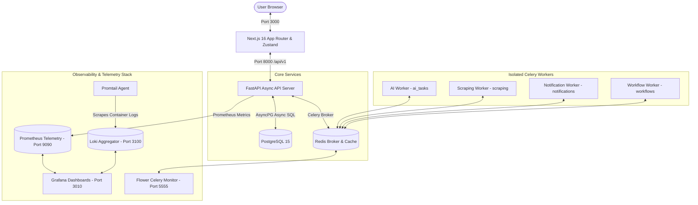

# AI-Driven Job Search & Workflow Automation Platform

A production-grade, highly resilient, and distributed **Job Search, AI Resume Tailoring, and Workflow Orchestration Platform**. This application is constructed using a modern microservice architecture containing **13 containerized services** working in absolute synchronization.

---

## 🚀 System Architecture

The diagram below details the ingestion, processing, worker coordination, and telemetry pipelines of the application:



---

## 🛠️ Technology Stack

### 1. Frontend Core
* **Framework**: Next.js 16 (App Router, Server Components)
* **Styling**: Vanilla CSS, Tailwind CSS for glassmorphic elements and high-fidelity dark-mode layout
* **State Management**: Zustand (stores for `authStore` with persist-state support)
* **Icons & UI Details**: Lucide Icons, micro-animations, and smooth transition-all hover effects
* **API Client**: Custom async `apiClient` wrapper supporting **seamless authorization bearer attaching and HTTP 401 token refresh rotation**.

### 2. Backend API Layer
* **Framework**: FastAPI (asynchronous endpoints, structured routing namespaces)
* **Server**: Uvicorn (managed non-root processes inside Docker)
* **Database Driver**: SQLAlchemy Async engine + `asyncpg` for PostgreSQL connection pooling
* **Authentication & Security**: Passlib (Bcrypt hashing, pinned to `<4.0.0` for legacy wrap compatibility), PyJWT, and CORS middlewares.
* **Instrumentation**: Prometheus telemetry collector middleware tracking HTTP latency and status codes.

### 3. Distributed Background Processing
* **Broker & Backend**: Redis 7-alpine (configured with connection pools)
* **Task Queues**: Celery 5.x working in asynchronous concurrency mode
* **Worker Pools**: Four isolated, domain-specific background worker pools:
  * `ai_tasks`: ATS relevance scoring, gap evaluation, and STAR-method resume optimization.
  * `workflows`: Coordinators executing Celery canvas chains (e.g. `optimize_resume` $\rightarrow$ `email_delivery`).
  * `scraping`: Web scraping aggregates of real-world jobs.
  * `notifications`: SMTP email dispatchers and webhook emitters.
* **Resiliency**: Built-in Dead-Letter Queue (DLQ) catching and preserving failing tasks, with interactive replay actions in the Workflow dashboard.

### 4. Enterprise Observability Stack
* **Flower**: Celery task tracking console (Port 5555)
* **Prometheus**: Real-time metrics aggregator (Port 9090)
* **Loki**: Microservice centralized log aggregator (Port 3100)
* **Promtail**: Docker-native container log scraper and shipper
* **Grafana**: Sleek visual telemetry dashboards displaying CPU loads, request volumes, and Loki logging panels (Port 3010)

---

## 📂 Project Structure

```
job-tracker/
├── backend/
│   ├── app/
│   │   ├── api/v1/          # FastAPI routers (auth, jobs, resumes, workflows, ai)
│   │   ├── core/            # Configuration settings, dependencies, celery setup
│   │   ├── db/              # SQLAlchemy session initialization
│   │   ├── models/          # Database ORM models (User, Job, Resume, WorkflowRun)
│   │   ├── schemas/         # Pydantic models for validation
│   │   └── tasks/           # Celery async tasks (ai, notifications, scraping, workflows)
│   ├── tests/               # 100% green Async SQLite pytest suite
│   └── Dockerfile           # Multi-stage container build
├── frontend/
│   ├── src/
│   │   ├── app/             # Next.js pages (dashboard, login, register)
│   │   ├── lib/             # API client, Zustand stores
│   │   └── services/        # Frontend API call services
│   └── Dockerfile           # Alpine optimized multi-stage build
├── docker-compose.yml       # 13-service orchestration stack
└── .env                     # Global workspace environment credentials
```

---

## ⚡ Setup & Quickstart

### Prerequisites
* Docker & Docker Compose installed on your host system.

### Step 1: Initialize Environment
Clone the repository and copy the environment template:
```bash
cp .env.example .env
```
Open `.env` and review database settings. You can keep the placeholder AI API keys intact; the backend will automatically coordinate to highly functional **mock fallback responses** if paid keys are missing!

### Step 2: Build & Start Stack
Execute the Docker build script:
```bash
docker compose up --build -d
```
Docker will construct Next.js compiler assets, spin up Celery workers, configure Postgres tables dynamically on startup, and launch telemetry collectors.

### Step 3: Access Dashboards
Once fully running, the following services are instantly accessible in your browser:
* **Frontend Web Dashboard**: [http://localhost:3000](http://localhost:3000)
* **FastAPI Backend Swagger Docs**: [http://localhost:8000/docs](http://localhost:8000/docs)
* **Celery Flower Monitoring Panel**: [http://localhost:5555](http://localhost:5555)
* **Grafana Telemetry Dashboard**: [http://localhost:3010](http://localhost:3010)
* **Prometheus Raw Telemetry Console**: [http://localhost:9090](http://localhost:9090)

---

## ⚙️ Core Integration Workflows

### 💼 Job Search Tab
* Fully integrated database seeding hooks pre-populate standard visual jobs (e.g. `Senior FastAPI Backend Developer`) if the PostgreSQL database is fresh.
* Real-time backend search (`GET /api/v1/jobs/search`) applies filters for keywords, remote status, and geographical locations.
* User Job Save (`POST /api/v1/jobs/save`) links jobs to active candidates and displays them in their tracker.

### 📝 AI Resume Optimizer Tab
* Seeding engines inject two default mock resumes (`Principal Architect` and `DevOps Engineer`) matching initial dashboard profiles.
* Triggering `Optimize with AI` extracts candidate experience content and evaluates match parameters.
* **API Resiliency**: Includes `ProviderFactory` failover strategies, automatically descending through `OpenAI` $\rightarrow$ `Anthropic` $\rightarrow$ `Gemini` $\rightarrow$ local `Ollama` $\rightarrow$ high-fidelity offline mock suggestions if paid keys are absent.

### 🔄 Workflow Orchestrator Tab
* Manually dispatch eager automation canvas chains via the dashboard controls.
* Launches Celery background pipelines tracking intermediate processing logs.
* Monitors task state changes dynamically via `AsyncResult` polling in the backend.
* Simulates Dead-Letter Queue (DLQ) capture tracing, with live `Replay from DLQ` re-queuing functionality.

---

## 🧪 Running Tests

The backend test suite is highly isolated, using an **in-memory Async SQLite database** to execute rapid mock comparisons.

Run all tests inside your local environment or backend container:
```bash
cd backend
pytest
```
*All 27 integration tests are configured to verify OAuth token rotations, AI mock provider failovers, database schema migrations, and Celery task retries.*
